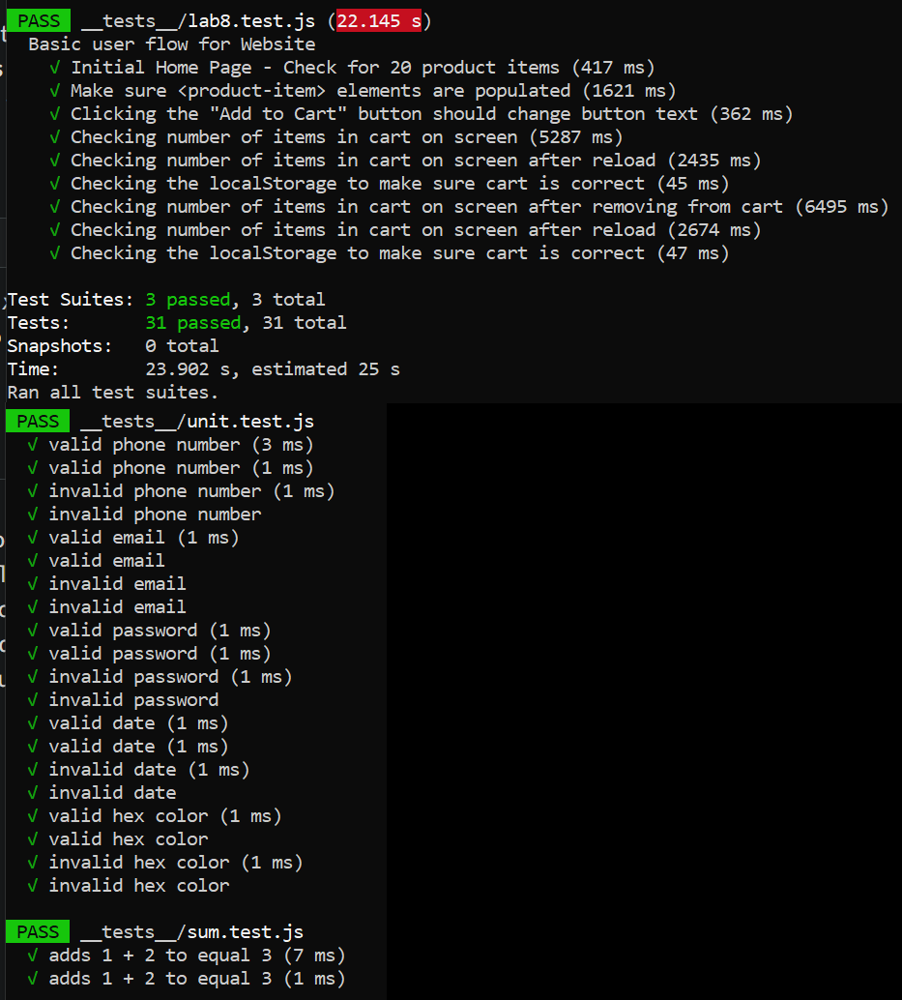

# Lab 8 - Starter
Question 1: Manually run them locally before pushing code  
The reason being that we should complete our automated test at the development level and make sure and tests passed and have a working build before pushing code to the repository.  

Question 2: Would you use an end to end test to check if a function is returning the correct output?  
No  

Question 3: Would you use a unit test to test the “message” feature of a messaging application? Why or why not?  
I would NOT use a unit test because the "message" feature usually requires a lot of highly coupled functions to it.  

Question 4: Would you use a unit test to test the “max message length” feature of a messaging application? Why or why not?  
I would use a unit test because max message length is a simple individual check.

